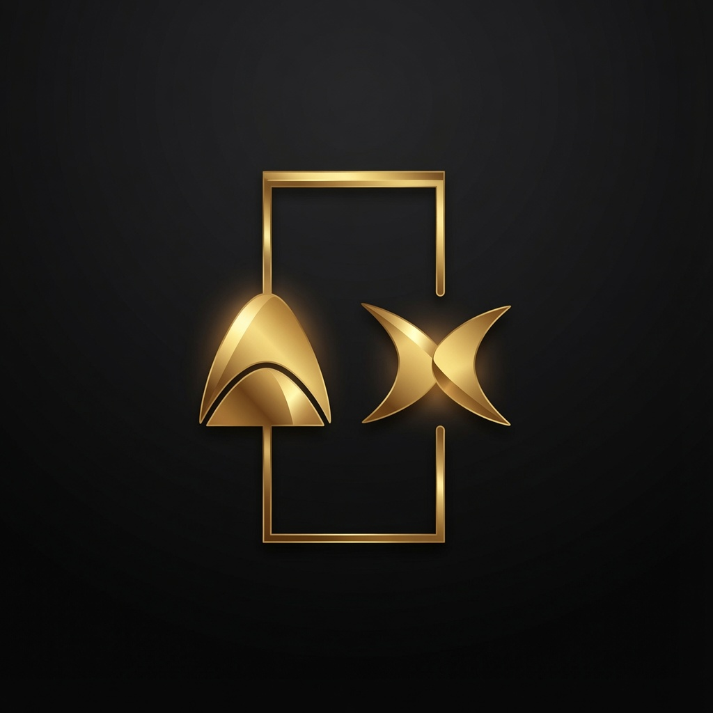

# ArenaX — Web3 · Art · Gaming

> The premier Web3 alpha community for art lovers, gamers & degenerates.



---

## Overview

ArenaX is a community-driven Web3 hub built around alpha sharing, NFT plays, gaming culture, and on-chain ecosystem intelligence. This repository contains the fully static, zero-dependency landing page — ready to deploy anywhere in seconds.

---

## Live Site

**[arenaxalpha.netlify.app](https://arenaxalpha.netlify.app)**

---

## Community Links

| Platform | Link |
|----------|------|
| X / Twitter | [x.com/ArenaXAlpha](https://x.com/ArenaXAlpha) |
| Discord | [discord.gg/ntHQRjHz](https://discord.gg/ntHQRjHz) |
| Telegram | [t.me/+5beXHqVcPNBmNTA0](https://t.me/+5beXHqVcPNBmNTA0) |

---

## File Structure

```
arenax/
├── index.html     # Full landing page (HTML + CSS + JS, single file)
└── logo.jpg       # ArenaX brand logo
```

No build step. No dependencies. No node_modules. Just two files.

---

## Sections

| # | Section | Description |
|---|---------|-------------|
| 1 | **Hero** | Logo, animated title, CTA buttons, stats bar |
| 2 | **About** | Community description, tags, key metrics |
| 3 | **X Feed** | Latest posts from @ArenaXAlpha with engagement stats |
| 4 | **Collaborations** | Partner project cards with live avatar fetching |
| 5 | **Join** | Discord / Telegram / X community cards |
| 6 | **Footer** | Brand, navigation, ecosystem links |

---

## Collaborations Featured

| Project | X Handle |
|---------|----------|
| Goblynz NFT | [@GoblynzNFT](https://x.com/GoblynzNFT) |
| GeezonApe | [@GeezOnApe](https://x.com/GeezOnApe) |
| Rilato | [@0xRilato](https://x.com/0xRilato) |
| Pacific Pod | [@PacificPodNFT](https://x.com/PacificPodNFT) |
| NuclearSamurai | [@nuclearsamurai](https://x.com/nuclearsamurai) |
| Giraffes | [@giraffies_nft](https://x.com/giraffies_nft) |

Collab avatars are fetched live from `unavatar.io` — falls back to gold initials if unavailable.

---

## Design System

### Colors
| Token | Value | Usage |
|-------|-------|-------|
| `--gold` | `#C9A84C` | Primary accent, logo glow |
| `--gold-bright` | `#F0D080` | Hover states, headings |
| `--gold-dim` | `#7A6530` | Labels, eyebrows |
| `--bg` | `#060607` | Page background |
| `--text` | `#EDE8DC` | Body text |
| `--discord` | `#5865F2` | Discord accent |
| `--tg` | `#29A8E0` | Telegram accent |

### Typography
- **Display** — `Cinzel` (serif) — headings, logo, stats
- **Body** — `DM Sans` — paragraphs, buttons, UI
- **Mono** — `Space Mono` — labels, eyebrows, dates, code

### Animations
- Floating logo with dual orbit rings
- Particle canvas with gold network lines
- Drifting grid background
- Hero scanline sweep on load
- Scroll-reveal stagger on all sections
- Gold shimmer swipe on all buttons
- Orbital spinner in About section
- Infinite gold ticker strip

---

## Deployment

### Netlify (recommended)

1. Go to [app.netlify.com](https://app.netlify.com)
2. Drag and drop the `arenax/` folder onto the deploy zone
3. Done — live in under 30 seconds

### Netlify CLI

```bash
npm install -g netlify-cli
netlify deploy --dir . --prod
```

### GitHub Pages

```bash
git init
git add .
git commit -m "ArenaX landing page"
git branch -M main
git remote add origin https://github.com/YOUR_USERNAME/arenax.git
git push -u origin main
```
Then enable Pages in repo Settings → Pages → Deploy from `main` branch root.

### Vercel

```bash
npm install -g vercel
vercel --prod
```

### Any static host

Upload `index.html` and `logo.jpg` to the same directory. No server-side logic required.

---

## Updating Content

### Change the X feed posts
Search for `tweet-card` in `index.html` — each card is a self-contained `<div>`. Edit the `.tc-body` text, `.tc-date`, and metric numbers directly.

### Add / remove a collaboration
Find the `COLLABS` array in the `<script>` block at the bottom of `index.html`:

```js
const COLLABS = [
  { name: 'Project Name', handle: '@handle', url: 'https://x.com/handle', tag: 'Category', initials: 'PN' },
  // add more here
];
```

### Update stats
The hero stats bar and about stats grid are plain HTML — search for `hstat-val` and `astat-val` to find and edit the numbers.

### Swap the logo
Replace `logo.jpg` with your new file (keep the same filename), or update the two `src="logo.jpg"` references in `index.html`.

---

## Browser Support

| Browser | Support |
|---------|---------|
| Chrome 90+ | ✅ Full |
| Firefox 88+ | ✅ Full |
| Safari 14+ | ✅ Full |
| Edge 90+ | ✅ Full |
| Mobile Chrome / Safari | ✅ Full (custom cursor auto-disabled) |

---

## Performance Notes

- Zero npm dependencies — loads instantly
- Fonts loaded via Google Fonts with `preconnect`
- Collab avatars lazy-fetched after page load — never blocks rendering
- Particle canvas pauses rendering off-screen via `requestAnimationFrame`
- All images use `loading="eager"` only for the above-fold logo; everything else defers naturally

---

## License

All rights reserved © 2024 ArenaX.  
Brand assets and community links are property of ArenaX.

